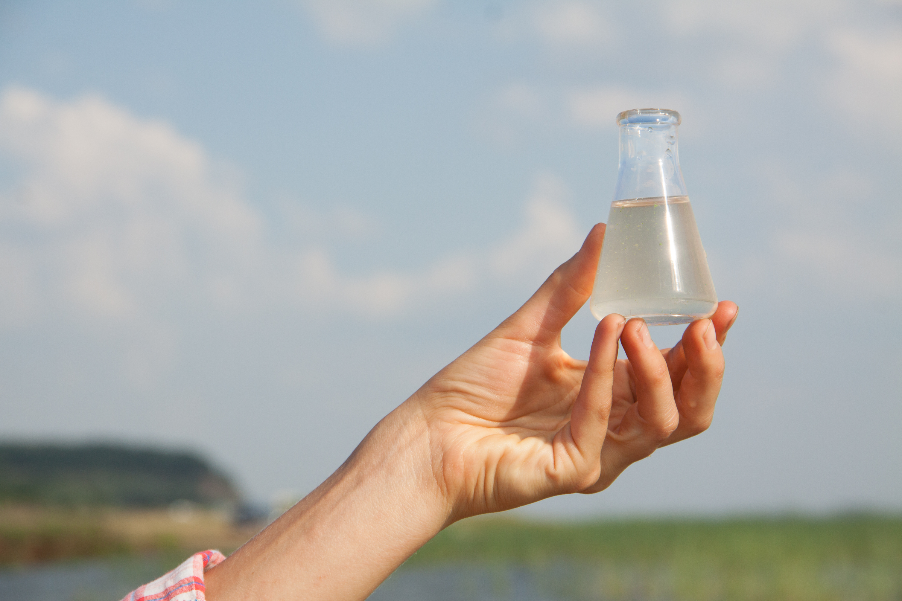

```{r setup, include=FALSE}
knitr::opts_chunk$set(echo = TRUE, collapse = TRUE, warning = FALSE, results='asis')

## instruções para publicação no github: https://youtu.be/0GjUWgl03vA

#git >- more >- shell >- git add . >- git commit -m "xxx built" .
#https://github.com/souzademarcelo/Qualidade_da_Agua_2023.github.io.git

```


```{r packs, echo=FALSE, warning=FALSE, results='hide', message=FALSE}
library(dplyr)
library(tidyr)
library(RPostgreSQL)
library(ggplot2)
library(lubridate)
library(htmltools)
library(rsconnect)
library(shinyWidgets)
library(nortest)
library(DBI)
library(NADA)
library(readr)
library(tidyverse)
library(sf)
library(mapview)
library(Hmisc)
library(knitr)
library(kableExtra)
library(htmlwidgets)
library(sp)
library(lattice)
library(leafpop)
library(rgdal)
```


```{r, echo=FALSE}


drv<- dbDriver("PostgreSQL")
con <- dbConnect(drv, dbname = "qa_v01_14_local", 
                 host = "localhost", port = 5432,
                 user = "postgres", password ="postgres" )

parametro <- 'od'
parametro_abreviado <- "OD"
parametro_extenso <- "Oxigênio Dissolvido na água"

serie_ini <- as.Date('2010-01-01', format = "%Y-%m-%d")
serie_final <- as.Date('2023-12-31', format = "%Y-%m-%d")

# Extrai os anos das datas
ini <- substr(serie_ini, 1, 4)
final <- substr(serie_final, 1, 4)

```

   
### **Qualidade da Água**

A qualidade da água nos corpos hídricos é determinada pelas condições naturais e ações humanas praticadas na bacia hidrográfica. Entre os fatores naturais que influenciam a qualidade da água em rios e lagos estão:    

- A dissolução de minerais presentes no solo e subsolo em função do intemperismo;   
- Processos atmosféricos de evapotranspiração e deposição de partículas carreadas pelo vento;    
- Decomposição da matéria orgânica e lixiviação natural de nutrientes;    
- Fatores hidrológicos ligados ao regime de escoamento; e processos biológicos que alteram a composição física e química da água. 
    
<div style='float:right; padding-left: 15px'>

```{r fig_poluicao, echo = FALSE}

knitr::include_graphics("poluicao.jpg")

```

</div>
     

Atualmente as ações humanas têm sido apontadas como a principal causa da degradação da qualidade da água que usamos para os mais diversos fins. Das volumosas cargas de efluentes e lixo despejadas nos rios e lagos aos invisíveis micropoluentes e agentes químicos que ameaçam a saúde dos seres vivos, somos responsáveis por uma ampla variedade de poluentes que se acumulam em nossas águas todos os dias. 

Entre os principais contaminantes da água, destacam-se:    

- Matéria orgânica e outros compostos que consomem oxigênio em sua degradação;
- Microrganismos causadores de doenças (patógenos);    
- Nutrientes, principalmente fósforo e nitrogênio;     
- Metais pesados;     
- Compostos orgânicos presentes em pesticidas;    
- Micropoluentes, como disruptores endócrinos e microplásticos.    

<br>

### **Monitoramento da Qualidade da Água nos Rios**

O monitoramento da qualidade da água consiste basicamente na obtenção de informações quantitativas e representativas sobre as características físicas, químicas e biológicas da água em determinados trechos de um corpo hídrico ao longo do tempo. Os dados resultantes do monitoramento permitem avaliar a adequação da água para diversos usos com base em parâmetros de qualidade e valores de referência.


<div style= "float:center;position: relative; top: 0px">
    
```{r fig_monitoramento, echo = FALSE}



```
    
</div>
    
<br>

### **Redes de Monitoramento no Brasil**

As principais redes de monitoramento da qualidade de água dos rios brasileiros são operadas por órgãos governamentais responsáveis pela gestão ambiental e dos recursos hídricos nas Unidades da Federação (UFs). O mapa abaixo mostra as UFs que operam estas redes no Brasil e a quantidade de pontos de monitoramento com dados de qualidade da água em nossa base no período de 2010 a 2021. 

<div style= "float:center;position: relative; top: 0px">
    
```{r pontos_uf,  echo=FALSE, warning=FALSE, message=FALSE, out.width = '100%'}
options(OutDec=",", digits = "2")
#knitr::include_graphics("pontos_uf.png")

parametro_sql <- paste("SELECT codigo, data,  ", parametro, "  as valor, ", parametro, "_st as status FROM pgquali.qlttb_2_par_", parametro, " where ", parametro, "_st in (1,2) ORDER BY codigo", sep = "")
  tbl <- dbGetQuery(con, parametro_sql)

# Filtra para o período e valores impossíveis (OD<18 mg/L) segundo a referência: Readings above 18 mg/l are physically impossible at Earth’s surface: https://www.knowyourh2o.com/outdoor-4/dissolved-oxygen-in-water
tbl <- tbl %>%
  filter(data >= serie_ini & data <= serie_final, 
         valor < 18)

# Contagem dos pontos
ponto_obs <- length(unique(tbl$codigo))
# Contagem das observações no período
parametro_obs <- length(tbl$valor)

# Importa tabela de pontos
pontos_sql <- paste("SELECT codigo, uf, latitude, longitude, enquadramento, corpo_hidrico FROM pgquali.qltft_1_pontos ORDER BY uf, codigo;", sep = "")
pontos <- dbGetQuery(con, pontos_sql)
coordenadas <- data.frame(
  codigo = c(pontos$codigo),
  UF = c(pontos$uf),
  lon = c(pontos$longitude[!is.na(pontos$longitude)]),
  lat = c(pontos$latitude[!is.na(pontos$latitude)]),
  classe = c(pontos$enquadramento),
  rio = c(pontos$corpo_hidrico),
  stringsAsFactors = FALSE)

# cria coluna com valor (0/1) apontando desconformidade dom a classe 2)
tbl <- tbl %>%
   mutate(desc2 = case_when(valor <=5 ~ 1, valor > 5 ~ 0))

# estatístcas e desconformidadade com a classe 2 
grouped_obs <- tbl %>%
    group_by(codigo) %>%
    summarise(n=n(), média=mean(valor), desconformidade = (sum(desc2)/n*100), início=min(data), final=max(data)) 

# Join tabela de observações com a de pontos
grouped_obs <- left_join(grouped_obs, coordenadas, by = c("codigo" = "codigo"))
grouped_obs <- na.omit(grouped_obs)

# Conta o número de pontos com registro de OD no período analisado
obs_uf <- grouped_obs %>%
  group_by(UF) %>%
    summarise(n = n(),.groups = 'drop') %>%
    rename(Pontos = n)

# importando o shape da pasta BR_UF_2022 no diretório de trabalho

shp <- readOGR("BR_UF_2022\\.", "BR_UF_2022", stringsAsFactors=FALSE, encoding="UTF-8", verbose = FALSE) 

# Une o shape das UFs com o DF contendo o número de pontos por UF 
obs_uf_shp <- merge(shp,obs_uf, by.x = "SIGLA_UF", by.y = "UF")

proj4string(obs_uf_shp) <- CRS("+proj=longlat +datum=WGS84 +no_defs")

Encoding(obs_uf_shp$NM_UF) <- "UTF-8"

state_popup <- paste0("<strong>Estado: </strong>", obs_uf_shp$NM_UF)

# obs_uf_shp$Score[is.na(obs_uf_shp$Pontos)] <- 0

obs_uf_shp <- na.omit(obs_uf_shp)

# renomeia coluna NM_UF para Estado
names(obs_uf_shp)[names(obs_uf_shp) == "NM_UF"] <- "UF"

# pal <-  mapviewPalette("mapviewSpectralColors")
# mapview(obs_uf_shp["Pontos"], popup = popupTable(obs_uf_shp, zcol= c("Pontos", "UF"), row.numbers=FALSE, feature.id=FALSE),
#         at = seq(1,800,100),
#         map.types = c("CartoDB.Positron", "Esri.WorldImagery"), 
#         # cex = 3, # tamanho dos markers 
#         # lwd = 0.2, #espessura da linha dos markers
#         alpha.regions = 100, #opacidade dos markers
#         legend = TRUE, 
#       #  col.regions = (pal (30)),
#         layer.name = "Monitoramento nas UFs")
pal <-  mapviewPalette("mapviewSpectralColors")
mapview(obs_uf_shp["Pontos"], popup = popupTable(obs_uf_shp, zcol= c("UF", "Pontos"), row.numbers=FALSE, feature.id=FALSE),
layer.name = "Monitoramento nas UFs",  
at = seq(1,900,100),
legend = TRUE, 
alpha.regions = 0.5)

```
    
</div>

Estas redes estão sendo integradas à Rede Nacional de Monitoramento de Qualidade das Águas (RNQA), criada em 2013 pela ANA depois de ampla discussão com as UFs sobre seu escopo, funcionamento e sustentabilidade financeira. A expansão destas redes a todas UFs é prevista segundo critérios do projeto da RNQA. São objetivos da RNQA:   

- Analisar a tendência de evolução da qualidade das águas superficiais;
- Avaliar se a qualidade atual das águas atende os usos estabelecidos pelo seu enquadramento;
- Identificar áreas críticas com relação à poluição hídrica;
- Aferir a efetividade da gestão sobre as ações de recuperação da qualidade das águas superficiais;
- Apoiar as ações de planejamento, outorga, licenciamento e fiscalização.

<br>

### **Monitoramento e Enquadramento**

<div style='float:right; padding-left: 15px'>

```{r fig_enquadramento, echo = FALSE}

knitr::include_graphics("enquadramento.jpg", dpi = 180)

```

</div>

O monitoramento tem a importante função de apontar áreas prioritárias para ações de controle da poluição da água e tendências na qualidade da água ao longo do tempo. Os dados do monitoramento também revelam se a água dos rios apresenta qualidade compatível com os usos a que se destina. Esta é, portanto, uma atividade aliada à implementação dos instrumentos de gestão de recursos hídricos, especialmente o enquadramento dos corpos hídricos em classes de qualidade segundo os usos preponderantes da água.

O enquadramento de corpos de água em classes é um instrumento da Política Nacional de Recursos Hídricos (Lei Federal nº 9.433/1997) que busca estabelecer um nível de qualidade da água em um determinado trecho rio que seja adequado aos seus usos preponderantes, atuais ou pretendidos. O conceito por trás do instrumento é estabelecer para as águas brutas padrões de qualidade a serem mantidos ou metas a serem perseguidas por meio das ações de gestão da qualidade da água.


A Resolução CONAMA nº 357/2005 estabelece um sistema de classificação em que, para cada classe, há possíveis destinações de usos e um conjunto de condições e padrões de qualidade a serem cumpridos com base em parâmetros físicos, químicos e biológicos. Para a água doce, em rios e lagos, são definidas cinco classes de qualidade de água (classe especial, 1, 2, 3 e 4). A resolução define limites individuais para mais de 90 parâmetros e condições que devem ser alcançados em cada uma das classes. A classe especial é uma exceção neste sentido, uma vez as condições naturais da água em um trecho de classe especial devem ser mantidas independemente de parâmetros preestablecidos com base nos usos.

    
O enquadramento dos corpos de água em classes de qualidade de acordo com os usos preponderantes pretendidos ocorre por meio de um processo participativo que culmina com a aprovação das metas de qualidade pelos conselhos de recursos hídricos estaduais ou federal, dependendo da dominialidade do rio ou lago. Segundo a resolução CONAMA nº 357/2005, enquanto não aprovados os respectivos enquadramentos, as águas doces serão consideradas classe 2, exceto se as condições de qualidade atuais forem melhores, o que determinará a aplicação da classe mais rigorosa correspondente.

O mapa abaixo mostra as classes de qualidade definidas pela resolução CONAMA nº 357/2005 nos trechos onde se encontram os pontos de monitoramento das redes operadas pelas UFs. 


```{r enquadramento, echo=FALSE, collapse = TRUE, layout="l-body-outset", out.width = '100%'}
options(OutDec=",",  digits = "2")
# Importa tabela de pontos
pontos_sql <- paste("SELECT codigo, uf, latitude, longitude, enquadramento, corpo_hidrico FROM pgquali.qltft_1_pontos ORDER BY uf, codigo;", sep = "")
pontos <- dbGetQuery(con, pontos_sql)
coordenadas <- data.frame(
  Código = c(pontos$codigo),
  UF = c(pontos$uf),
  lon = c(pontos$longitude[!is.na(pontos$longitude)]),
  lat = c(pontos$latitude[!is.na(pontos$latitude)]),
  classe = c(pontos$enquadramento),
  Rio = c(pontos$corpo_hidrico),
  stringsAsFactors = FALSE)

coordenadas <- st_as_sf(coordenadas, coords = c("lon", "lat"), crs = 4674) 

classes <- na.omit(coordenadas)

classes <- classes %>%
  mutate(Classe = case_when(
 classe == 12 ~ "Não enquadrado",
 classe == 0 ~ "Especial",
 classe == 1 ~ "Classe 1",
 classe == 2 ~ "Classe 2",
 classe == 3 ~ "Classe 3",
 classe == 4 ~ "Classe 4",
 classe == 99 ~ "Sem informação",
 is.na(classe) ~ "Sem informação"
  )
)

pal = colorRampPalette(c('light sky blue', 'lime green', 'orange', 'red', 'dodger blue', 'gainsboro', 'wheat'))
mapview(classes["Classe"], popup = popupTable(classes, zcol=c("Código", "UF", "Rio", "Classe"), row.numbers=FALSE, feature.id=FALSE),
        #map.types = c("CartoDB.Positron", "Esri.WorldImagery"), 
        cex = 3, # tamanho dos markers 
        lwd = 0.2, #espessura da linha dos markers
        alpha.regions = 100, #opacidade dos markers
        legend = TRUE, 
        col.regions = (pal (7)),
        layer.name = "Classes de qualidade")

```
